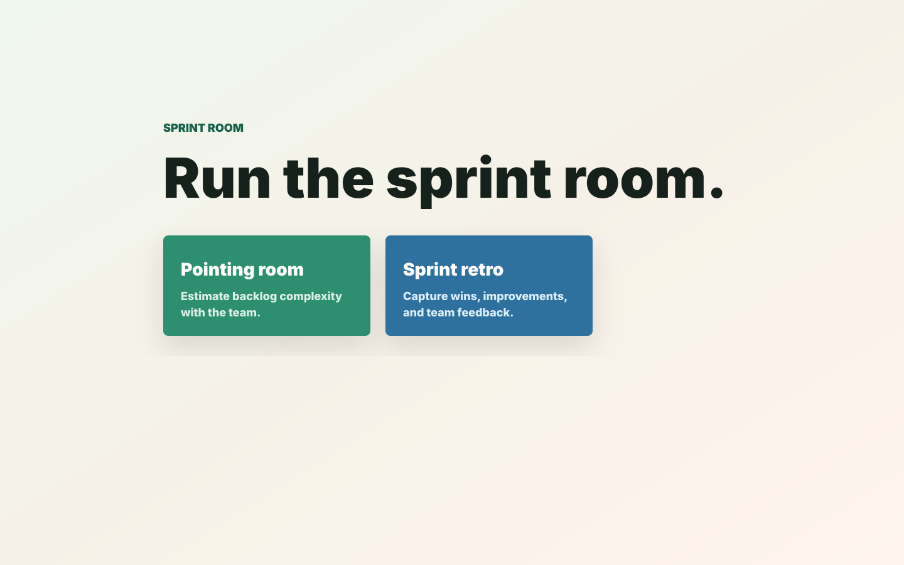
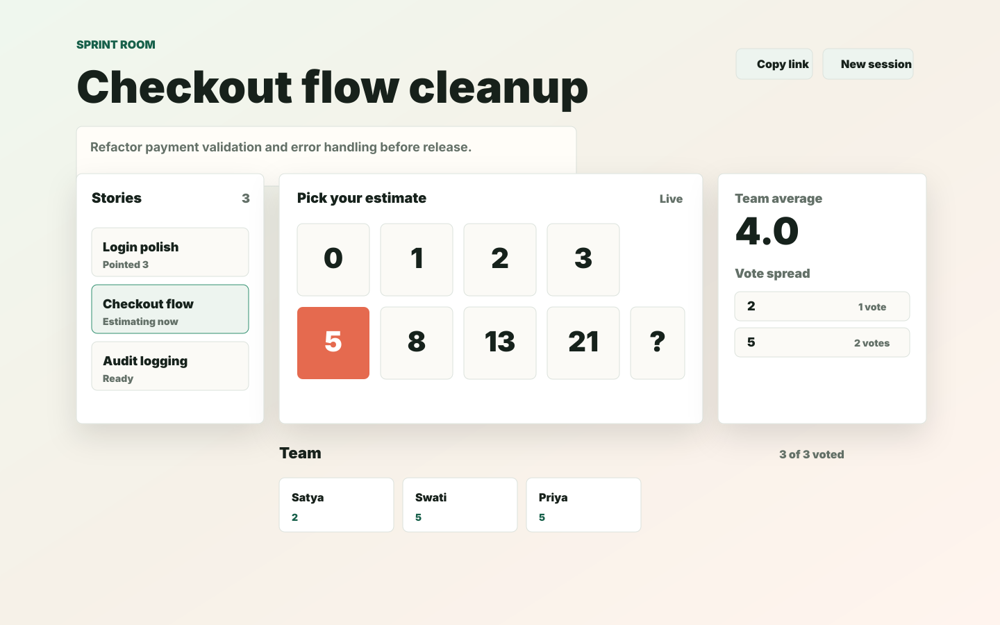
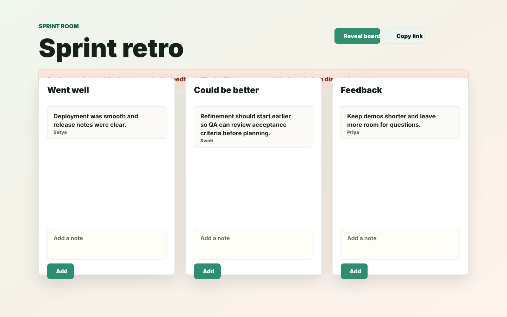

# Sprint Room

Sprint Room is a no-login collaboration app for sprint ceremonies. A facilitator creates a shareable room, teammates join with a name, and the team can run either story pointing or a sprint retro from the same lightweight site.



## Features

- **Pointing room:** estimate stories with Fibonacci-style cards, reveal controls, averages, and vote distribution.
- **Story backlog:** add story titles and descriptions up front, switch between stories, and keep estimates per story.
- **Sprint retro:** collect notes in Went well, Could be better, and Feedback columns.
- **Private retro cards:** teammates see only their own cards until the facilitator reveals the board.
- **No accounts:** the session creator gets facilitator controls in their browser; everyone else joins from the shared link.
- **Session history:** rooms are persisted to `data/sessions.json` and expire after inactivity.

## Screenshots

### Pointing Room



### Sprint Retro



## Run Locally

```bash
python3 app.py
```

Open `http://127.0.0.1:8000`, choose **Pointing room** or **Sprint retro**, then share the generated URL.

## Pointing Workflow

1. The facilitator creates a **Pointing room**.
2. The facilitator can add story titles and descriptions before or during refinement.
3. Any participant can choose a prepared story from the sidebar.
4. Everyone picks an estimate.
5. Only the facilitator can reveal votes, clear the round, edit stories, or move to the next story.
6. Revealed stories keep their estimate, average, vote spread, and participant votes.

## Retro Workflow

1. The facilitator creates a **Sprint retro**.
2. Everyone joins with a name and adds cards privately.
3. Contributors see their own cards; the facilitator sees all cards.
4. The facilitator clicks **Reveal board** when the team is ready to discuss.
5. After reveal, everyone sees the full board.

## Run With Docker

Build the image:

```bash
docker build -t sprint-room .
```

Run it with persistent session storage:

```bash
docker run -d \
  --name sprint-room \
  -p 8000:8000 \
  -e SESSION_TTL_DAYS=90 \
  -v sprint-room-data:/app/data \
  sprint-room
```

Open `http://localhost:8000`. The Docker volume keeps session history across container restarts and image upgrades.

To release a new version locally:

```bash
docker build -t sprint-room .
docker stop sprint-room
docker rm sprint-room
docker run -d --name sprint-room -p 8000:8000 -e SESSION_TTL_DAYS=90 -v sprint-room-data:/app/data sprint-room
```

## Internal Testing / Hosted Container

The app uses only the Python standard library. It serves the static website and WebSocket endpoint from the same process, so it can run in a small AWS container, EC2 instance, or internal dev portal service.

Recommended AWS shape:

1. Build and push the Docker image to ECR.
2. Run one ECS/Fargate task or one EC2 container.
3. Put an HTTPS load balancer or reverse proxy in front.
4. Ensure WebSocket traffic is allowed.
5. Mount persistent storage at `/app/data`, or replace file storage with DynamoDB before scaling to multiple instances.

Useful environment variables:

```bash
HOST=0.0.0.0
PORT=8000
DATA_FILE=/app/data/sessions.json
SESSION_TTL_DAYS=90
```

### Storage Note

File-backed sessions are simple and work well for one running container. If you run multiple app instances behind a load balancer, use sticky sessions plus shared storage, or move session state to DynamoDB/Redis/Postgres.

## Notes

- There is intentionally no login or admin account.
- Unknown or expired session URLs return users to the main page with a no-active-session notice.
- Facilitator permissions are stored in the creator’s browser storage for that session.
- If browser storage is cleared, the creator can still join, but facilitator controls for that existing session are lost.
